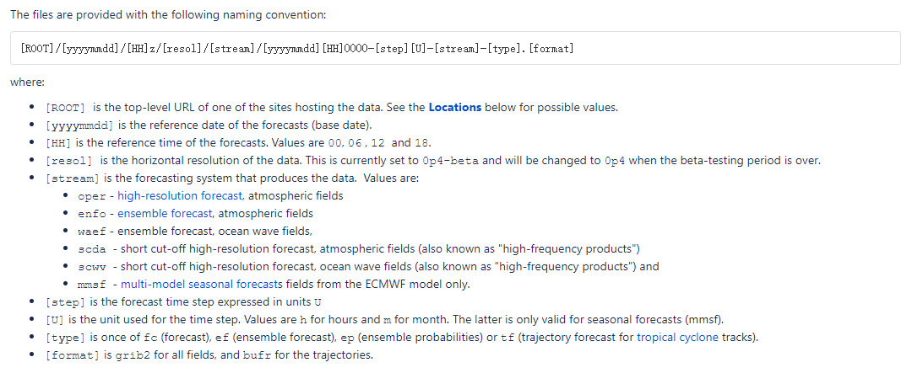

# Meteorological-Data-Download-Guide

# 完善中...

# 🌤️ 公开气象数据下载资源库

一个收集整理各类公开气象数据下载网址的资源库，旨在为气象研究、数据分析和应用开发提供便捷的数据获取渠道。

## 📚 目录

- [数值预报数据](#数值预报数据)
- [大模型预报数据](#大模型预报数据)
- [实况观测数据](#实况观测数据)
- [卫星数据](#卫星数据)
- [雷达数据](#雷达数据)
- [气候与再分析数据](#气候与再分析数据)
- [海洋气象数据](#海洋气象数据)
- [空气质量数据](#空气质量数据)
- [开源代码与工具](#开源代码与工具)
- [贡献指南](#贡献指南)
- [许可证](#许可证)
- [致谢](#致谢)

## 数值预报数据

### 实时预报数据

| 数据源 | 描述 | 子产品/配置 | 预报方法 | 分辨率 | 时效 | 更新频率 | 访问方式 | 时间范围 | 备注 |
| :---: | :---: | :---: | :---: | :---: | :---: | :---: | :---: | :---: | :---: |
| **ECMWF** | 欧洲中期天气预报中心 | **IFS** | 确定性预报 | 0.25° | 0\~144h(3h) 144\~360h(6h) | 每日4次 | [ECMWF Free & Open Data Portal](https://data.ecmwf.int/forecasts/) | 包含最近4日数据 | |
| | | **EFS** | 集合预报 | 0.25° | 0\~144h(3h) 144\~360h(6h) | 每日4次 | [ECMWF Free & Open Data Portal](https://data.ecmwf.int/forecasts/) | 包含最近4日数据 | |
| **NCEP** | 美国全球预报系统 | **GFS** |确定性预报 | 0.25°/0.5° | 0\~144h(3h) 144\~360h(6h) | 每日4次 | [GFS_UCAR](https://motherlode.ucar.edu/native/grid/NCEP/GFS/) | 包含最近3月数据 | |
| | | **GFS** | 确定性预报 | 0.25°/0.5° | 0\~144h(3h) 144\~360h(6h) | 每日4次 | [GFS_NOAA](https://nomads.ncep.noaa.gov/pub/data/nccf/com/gfs/) | 包含最近10日数据 | |
| | | **GEFS** | 集合预报 | 0.25°/0.5° | 0\~144h(3h) 144\~360h(6h) | 每日4次 | [GEFS_NOAA](https://nomads.ncep.noaa.gov/pub/data/nccf/com/gens/) | 包含最近4日数据 | |
| **DWD ICON** | 德国天气局全球模式 | **ICON** | 确定性预报 | 0.125° | 0\~144h(3h) 144\~360h(6h) | 每日4次 | [ICON](https://opendata.dwd.de/weather/nwp/icon/grib/) | 包含最近4个起报时次数据 | |
| **JMA** | 日本气象厅全球谱模式 | **GSM** | 确定性预报 | 0.25°/0.5° | 0\~144h(3h) 144\~360h(6h) | 每日4次 | [JMA High-Resolution GSM Data Service](https://www.wis-jma.go.jp/cms/gsm/download.html) | 包含最近5日数据 | |

> [ECMWF Free & Open Data Portal](https://data.ecmwf.int/forecasts/) —— ECMWF公开数据说明
>  包含IFS及AIFS，其中IFS数据格式说明如下：
> 

### 历史预报数据

| 主数据源 | 描述 | 子产品/配置 | 预报方法 | 分辨率 | 时效 | 更新频率 | 访问方式 | 时间范围 | 备注 |
| :---: | :---: | :---: | :---: | :---: | :---: | :---: | :---: | :---: | :---: |
| **ECMWF** | 欧洲中期天气预报中心 | **IFS (HRES)** | 确定性预报 | 0.25°/0.4° | 0\~144h(3h) 144\~360h(6h) | 每日4次 | [🪜ECMWF_GOOGLE](https://console.cloud.google.com/storage/browser/ecmwf-open-data;tab=objects?prefix=&forceOnObjectsSortingFiltering=false) | 2023年7月12日至今（最新数据较官网有延迟） | |
| | | **IFS (HRES \~ 地面)** | 确定性预报 | 0.1° | 0\~12h(6h) | 每日4次 | [IFS_UCAR](https://gdex.ucar.edu/datasets/d113001/dataaccess/#) | 2016年1月1日至今 | |
| | | **EFS** | 集合预报 | 0.25°/0.4° | 0\~144h(3h) 144\~360h(6h) | 每日4次 | [🪜ECMWF_GOOGLE](https://console.cloud.google.com/storage/browser/ecmwf-open-data;tab=objects?prefix=&forceOnObjectsSortingFiltering=false) | 2023年7月12日至今（最新数据较官网有延迟） | |
| **NCEP** | 美国全球预报系统 | **GFS** | 确定性预报 | 0.25°/0.5° | 0\~144h(3h) 144\~360h(6h) | 每日4次 | [GFS_UCAR](https://gdex.ucar.edu/datasets/d084001/dataaccess/) | 2015年1月15日至今 | |
| | | **GFS** | 确定性预报 | 0.25°/0.5° | 0\~144h(3h) 144\~360h(6h) | 每日4次 | [GFS_NOAA](https://nomads.ncep.noaa.gov/pub/data/nccf/com/gfs/) | 包含最近10日数据 | |
| | | **GEFS** | 集合预报 | 0.25°/0.5° | 0\~144h(3h) 144\~360h(6h) | 每日4次 | [GEFS_NOAA](https://nomads.ncep.noaa.gov/pub/data/nccf/com/gens/) | 包含最近4日数据 | |

## 大模型预报数据

### 实时预报数据

| 数据源 | 描述 | 预报方法 | 分辨率 | 时效 | 更新频率 | 访问方式 | 时间范围 | 备注 |
| :---: | :---: | :---: | :---: | :---: | :---: | :---: | :---: | :---: |
| **ECMWF-AIFS** | 欧洲中期天气预报中心 | 确定性预报 | 0.25° | 0\~360h(6h) | 每日4次 | [ECMWF Free & Open Data Portal](https://data.ecmwf.int/forecasts/) | 包含最近4日数据 | |
| **ECMWF-AIEFS** | 欧洲中期天气预报中心 | 集合预报 | 0.25°| 0\~360h(6h) | 每日4次  | [ECMWF Free & Open Data Portal](https://data.ecmwf.int/forecasts/) | 包含最近4日数据 | |
| **NCEP-AIGFS** | 美国全球预报系统 | 确定性预报 | 0.25°/0.5° | 0\~360h(6h) | 每日4次 | [AIGFS_NOAA](https://nomads.ncep.noaa.gov/pub/data/nccf/com/aigfs/) | 包含最近2日数据 | |
| **NCEP-AIGEFS** | 美国全球预报系统 | 集合预报 | 0.25°/0.5° | 0\~360h(6h) | 每日4次  | [AIGEFS_NOAA](https://nomads.ncep.noaa.gov/pub/data/nccf/com/aigefs/) | 包含最近2日数据 | |
| **Aurora** | 微软 | 确定性预报 | 0.5° | 0\~240h(6h) | 每日2次 | [🪜AWS-S3](https://noaa-oar-mlwp-data.s3.amazonaws.com/index.html) | | [数据说明](./docs/noaa-oar-mlwp-data.txt) |
| **FourCastNet** | NVIDIA | 确定性预报 | 0.5° | 0\~240h(6h) | 每日2次  | [🪜AWS-S3](https://noaa-oar-mlwp-data.s3.amazonaws.com/index.html) | | [数据说明](./docs/noaa-oar-mlwp-data.txt) |
| **GraphCast** | Google、DeepMind | 确定性预报 | 0.5° | 0\~240h(6h) | 每日2次  | [🪜AWS-S3](https://noaa-oar-mlwp-data.s3.amazonaws.com/index.html) | | [数据说明](./docs/noaa-oar-mlwp-data.txt) |
| **PANGU** | 华为 | 确定性预报 | 0.5° | 0\~240h(6h) | 每日2次  | [🪜AWS-S3](https://noaa-oar-mlwp-data.s3.amazonaws.com/index.html) | | [数据说明](./docs/noaa-oar-mlwp-data.txt) |

### 历史预报数据

| 数据源 | 描述 | 预报方法 | 分辨率 | 时效 | 更新频率 | 访问方式 | 时间范围 | 备注 |
| :---: | :---: | :---: | :---: | :---: | :---: | :---: | :---: | :---: |
| **ECMWF-AIFS**  | 欧洲中期天气预报中心 | 确定性预报 |   0.25°    | 0\~360h(6h) | 每日4次  | [ECMWF Free & Open Data Portal](https://data.ecmwf.int/forecasts/) |  包含最近4日数据  |                                           |
| **ECMWF-AIEFS** | 欧洲中期天气预报中心 |  集合预报  |   0.25°    | 0\~360h(6h) | 每日4次  | [ECMWF Free & Open Data Portal](https://data.ecmwf.int/forecasts/) |  包含最近4日数据  |                                           |
| **NCEP-AIGFS**  |   美国全球预报系统   | 确定性预报 | 0.25°/0.5° | 0\~360h(6h) | 每日4次  | [AIGFS_NOAA](https://nomads.ncep.noaa.gov/pub/data/nccf/com/aigfs/) |  包含最近2日数据  |                                           |
| **NCEP-AIGEFS** |   美国全球预报系统   |  集合预报  | 0.25°/0.5° | 0\~360h(6h) | 每日4次  | [AIGEFS_NOAA](https://nomads.ncep.noaa.gov/pub/data/nccf/com/aigefs/) |  包含最近2日数据  | |
| **Aurora**| 微软 | 确定性预报 | 0.5° | 0\~240h(6h) | 每日2次  | [🪜AWS-S3](https://noaa-oar-mlwp-data.s3.amazonaws.com/index.html) | 2025年1月23日至今 | [数据说明](./docs/noaa-oar-mlwp-data.txt) |
| **FourCastNet** | NVIDIA   | 确定性预报 | 0.5° | 0\~240h(6h) | 每日2次  | [🪜AWS-S3](https://noaa-oar-mlwp-data.s3.amazonaws.com/index.html) | 2020年9月30日至今 | [数据说明](./docs/noaa-oar-mlwp-data.txt) |
| **GraphCast**   | Google、DeepMind | 确定性预报 | 0.5° | 0\~240h(6h) | 每日2次  | [🪜AWS-S3](https://noaa-oar-mlwp-data.s3.amazonaws.com/index.html) | 2020年9月30日至今 | [数据说明](./docs/noaa-oar-mlwp-data.txt) |
| **PANGU** | 华为 | 确定性预报 | 0.5° | 0\~240h(6h) | 每日2次  | [🪜AWS-S3](https://noaa-oar-mlwp-data.s3.amazonaws.com/index.html) | 2020年9月30日至今 | [数据说明](./docs/noaa-oar-mlwp-data.txt) |

## 实况观测数据

### 地面观测

| 数据源 | 覆盖范围 | 要素 | 更新频率 | 访问方式 | 备注 |
|--------|----------|------|----------|----------|----------|
| **ASOS/AWOS** | 全球机场 | 多要素 | 实时 | [NOAA](https://www.ncei.noaa.gov/maps/hourly/) |  |
| **SYNOP** | 全球 | 基本气象要素 | 3/6小时 | [OGIMET](https://www.ogimet.com/) |  |
| **MADIS** | 北美 | 多源数据 | 实时 | [NOAA MADIS](https://madis.ncep.noaa.gov/) |  |

### 高空观测

| 数据源 | 覆盖范围 | 层次 | 更新频率 | 访问方式 | 备注 |
|--------|----------|------|----------|----------|----------|
| **IGRA** | 全球 | 标准层 | 每日2次 | [NOAA IGRA](https://www.ncei.noaa.gov/access/weather/igra/) |  |
| **AMDAR** | 全球航线 | 飞行层 | 实时 | [WMO AMDAR](https://amdar.wmo.int/) |  |

### 自动气象站

| 数据源 | 网络规模 | 区域 | 访问方式 | 备注 |
|--------|----------|------|----------|----------|
| **MesoWest** | 数千站 | 美国 | [MesoWest](https://mesowest.utah.edu/) |  |
| **Weather Underground** | 全球个人站 | 全球 | [WUnderground](https://www.wunderground.com/) |  |

## 卫星数据

### 地球同步卫星

| 卫星 | 机构 | 覆盖区域 | 主要产品 | 数据访问 | 备注 |
|------|------|----------|----------|----------|----------|
| **Himawari-8/9** | JMA | 亚太 | 云图、气溶胶 | [JAXA](https://www.eorc.jaxa.jp/ptree/) |  |
| **GOES-16/18** | NOAA | 美洲 | 多通道图像 | [NOAA GOES](https://www.noaa.gov/goes-16-and-goes-17-satellite-data) |  |
| **FY-4A/4B** | CMA | 亚洲 | 云图、降水 | [NSMC](http://satellite.nsmc.org.cn/) |  |

### 极轨卫星

| 卫星 | 机构 | 分辨率 | 主要产品 | 数据访问 | 备注 |
|------|------|--------|----------|----------|----------|
| **Suomi NPP** | NASA/NOAA | 750m | VIIRS数据 | [NASA LAADS](https://ladsweb.modaps.eosdis.nasa.gov/) |  |
| **JPSS** | NOAA | 375m | 多光谱数据 | [NOAA CLASS](https://www.avl.class.noaa.gov/) |  |
| **Sentinel-3** | ESA | 300m | 海洋颜色 | [Copernicus](https://scihub.copernicus.eu/) |  |

### 卫星降水产品

| 产品 | 空间分辨率 | 时间分辨率 | 覆盖范围 | 访问方式 | 备注 |
|------|------------|------------|----------|----------|----------|
| **GPM IMERG** | 0.1° | 30分钟 | 全球 | [NASA GES DISC](https://disc.gsfc.nasa.gov/) |  |
| **CMORPH** | 0.25° | 30分钟 | 全球 | [CPC](https://www.cpc.ncep.noaa.gov/products/janowiak/cmorph_description.html) |  |

## 雷达数据

### 天气雷达

| 网络 | 覆盖区域 | 产品类型 | 访问方式 | 备注 |
|------|----------|----------|----------|----------|
| **NEXRAD** | 美国 | 基数据、产品 | [NOAA NCEI](https://www.ncdc.noaa.gov/nexradinv/) |  |
| **OPERA** | 欧洲 | 合成产品 | [EUMETNET](https://www.eumetnet.eu/activities/observations-programme/current-activities/opera/) |  |

## 气候与再分析数据

### 再分析数据集

| 数据集 | 时段 | 分辨率 | 要素 | 访问方式 | 备注 |
|--------|------|--------|------|----------|----------|
| **ERA5** | 1950-现在 | 0.25° | 全面 | [ECMWF CDS](https://cds.climate.copernicus.eu/) |  |
| **MERRA-2** | 1980-现在 | 0.5° | 全面 | [NASA GES DISC](https://disc.gsfc.nasa.gov/) |  |
| **JRA-55** | 1958-现在 | 0.56° | 全面 | [JMA](https://jra.kishou.go.jp/JRA-55/) |  |

### 气候数据集

| 数据集 | 类型 | 分辨率 | 时段 | 访问方式 | 备注 |
|--------|------|--------|------|----------|----------|
| **CRU TS** | 格点化观测 | 0.5° | 1901-现在 | [UEA](https://crudata.uea.ac.uk/cru/data/hrg/) |  |
| **GPCC** | 降水 | 0.25°-2.5° | 1891-现在 | [DWD](https://www.dwd.de/EN/ourservices/gpcc/gpcc.html) |  |

## 海洋气象数据

### 海洋观测

| 数据源 | 观测平台 | 要素 | 访问方式 | 备注 |
|--------|----------|------|----------|----------|
| **Argo** | 剖面浮标 | 温盐深 | [Argo GDAC](https://argo.ucsd.edu/data/argo-data/) |  |
| **TAO/TRITON** | 锚定浮标 | 海洋气象 | [PMEL](https://www.pmel.noaa.gov/tao/) |  |

### 海洋模式

| 模式 | 机构 | 分辨率 | 产品 | 访问方式 | 备注 |
|------|------|--------|------|----------|----------|
| **HYCOM** | 美国海军 | 1/12° | 海洋分析预报 | [HYCOM](https://www.hycom.org/) |  |
| **CMEMS** | 欧盟 | 多种 | 海洋监测预报 | [Copernicus Marine](https://marine.copernicus.eu/) |  |

## 空气质量数据

### 空气质量监测

| 数据源 | 覆盖范围 | 污染物 | 访问方式 | 备注 |
|--------|----------|--------|----------|----------|
| **AirNow** | 美国 | 主要污染物 | [AirNow](https://www.airnow.gov/) |  |
| **OpenAQ** | 全球 | 多种污染物 | [OpenAQ](https://openaq.org/) |  |

### 空气质量模式

| 模式 | 机构 | 分辨率 | 产品 | 访问方式 | 备注 |
|------|------|--------|------|----------|----------|
| **CAMS** | ECMWF | 0.4° | 全球空气质量预报 | [CAMS](https://atmosphere.copernicus.eu/) |  |

## 开源代码与工具

### 数据下载与处理

| 工具 | 语言 | 功能 | 链接 | 备注 |
|------|------|------|------|------|
| **Herbie** | Python | GFS/HRRR数据下载 | [GitHub](https://github.com/blaylockbk/Herbie) |  |
| **Siphon** | Python | 远程数据访问 | [Unidata](https://github.com/Unidata/siphon) |  |
| **cfgrib** | Python | GRIB文件处理 | [ECMWF](https://github.com/ecmwf/cfgrib) |  |

### 可视化与分析

| 工具 | 语言 | 功能 | 链接 | 备注 |
|------|------|------|------|------|
| **MetPy** | Python | 气象数据分析可视化 | [Unidata](https://github.com/Unidata/MetPy) |  |
| **Cartopy** | Python | 地图制图 | [SciTools](https://github.com/SciTools/cartopy) |  |

## 贡献指南

我们欢迎并感谢所有形式的贡献！请参阅 [CONTRIBUTING.md](CONTRIBUTING.md) 了解详细的贡献指南。

### 如何贡献

1. **报告问题**：通过 [Issues](https://github.com/wait4xx/Meteorological-Data-Download-Guide/issues) 报告错误或建议新功能
2. **添加资源**：提交 Pull Request 添加新的气象数据资源
3. **改进文档**：帮助改进文档或翻译内容
4. **分享用例**：在 Discussions 中分享你的数据使用案例

### 提交规范

- 确保链接有效且可公开访问
- 提供清晰的数据描述和访问方式
- 遵循现有的分类和格式
- 注明数据许可和使用限制

## 许可证

**重要提示**：本资源库中列出的数据源可能有各自的使用条款和许可协议。在使用任何数据前，请务必查阅并遵守相应数据提供方的规定。

## 致谢

感谢所有数据提供机构以及为本项目做出贡献的开发者们！

### 主要数据提供机构

- 中国气象局 (CMA)
- 美国国家海洋和大气管理局 (NOAA)
- 欧洲中期天气预报中心 (ECMWF)
- 欧洲空间局 (ESA)
- 美国国家航空航天局 (NASA)

---

**注意**：数据链接和可用性可能会发生变化。如果您发现任何失效链接或有新的资源推荐，请通过 Issues 告知我们。

⭐ 如果这个项目对您有帮助，请给我们一个星标！
