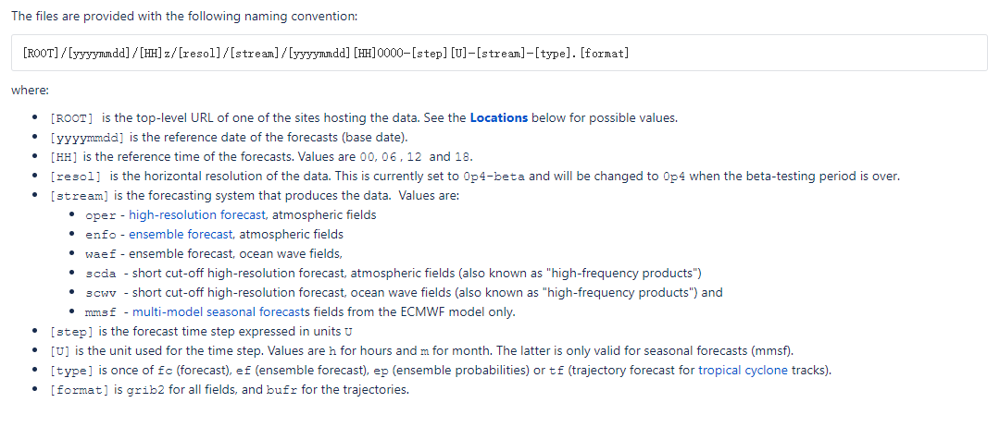

# 🌤️ 公开气象数据下载资源库

> 一个收集整理各类公开气象数据下载网址的资源库，旨在为气象研究、数据分析和应用开发提供便捷的数据获取渠道。

---

### 📢 最新动态
> **2026-03-03** · 🎇 更新readme文档，优化显示
> 
> **2025-12-09** · ✨ ECMWF 下载脚本升级 — 新增 **IFS / EFS / AIFS / AIEFS** 全系列数据支持
>
> **2025-12-05** · 🚀 ECMWF 下载脚本发布 — 支持 **4 线程并行下载**，大幅提升效率

---

### 🔧 项目进展

| 类别 | 状态 |
|:-----|:----:|
| 数值预报数据 | ✅ |
| 大模型预报数据 | ✅ |
| 再分析数据 | ✅ |
| 实时观测数据 | 🔜 |
| 卫星数据 | 🔜 |
| 雷达数据 | 🔜 |
| 气候数据 | 🔜 |
| 海洋气象数据 | 🔜 |
| 空气质量数据 | 🔜 |
| 开源代码与工具 | 🔜 |

---

## 📚 目录

| 数据类型 | 工具与社区 |
|:--------:|:----------:|
| [数值预报](#数值预报数据) · [大模型](#大模型预报数据) · [再分析数据](#气候与再分析数据) | [贡献指南](#贡献指南) · [许可证](#许可证) |
| [实况观测](#实况观测数据) · [海洋气象](#海洋气象数据) · [空气质量](#空气质量数据) | [开源工具](#开源代码与工具) |
| [卫星数据](#卫星数据) · [雷达数据](#雷达数据) | [致谢](#致谢) |

## 数值预报数据

### 实时预报数据

<b>ECMWF</b> · 欧洲中期天气预报中心

---

**IFS** · 确定性预报

_144~360h(6h)-green?style=flat-square)

🔗 [ECMWF Open Data](https://data.ecmwf.int/forecasts/) · 📅 最近 4 日

---

**EFS** · 集合预报

_144~360h(6h)-green?style=flat-square)

🔗 [ECMWF Open Data](https://data.ecmwf.int/forecasts/) · 📅 最近 4 日

---

**IFS 数据格式说明**

> 

<b>NCEP</b> · 美国全球预报系统

---

**GFS** · 确定性预报

_144~360h(6h)-green?style=flat-square)

🔗 [GFS_UCAR](https://motherlode.ucar.edu/native/grid/NCEP/GFS/) · 📅 最近 3 个月

---

**GFS** · 确定性预报

-green?style=flat-square)

🔗 [GFS_OpeNDAP](https://nomads.ncep.noaa.gov/dods/gfs_0p25_1hr/) · 📅 最近 10 日 · 📝 [Python/xarray 示例](./sources/download_from_opendap.py)

---

**GFS** · 确定性预报

-green?style=flat-square)

🔗 [GFS_OpeNDAP](https://nomads.ncep.noaa.gov/dods/gfs_0p25//) · 📅 最近 10 日 · 📝 [Python/xarray 示例](./sources/download_from_opendap.py)

---

**GFS** · 确定性预报

_120~384h(3h)-green?style=flat-square)

🔗 [GFS_NOAA](https://nomads.ncep.noaa.gov/pub/data/nccf/com/gfs/) · 📅 最近 10 日

---

**GFS** · 确定性预报

-green?style=flat-square)

🔗 [GFS_OpeNDAP](https://nomads.ncep.noaa.gov/dods/gfs_0p50/) · 📅 最近 10 日 · 📝 [Python/xarray 示例](./sources/download_from_opendap.py)

---

**GFS** · 确定性预报

-green?style=flat-square)

🔗 [GFS_OpeNDAP](https://nomads.ncep.noaa.gov/dods/gfs_1p00/) · 📅 最近 10 日 · 📝 [Python/xarray 示例](./sources/download_from_opendap.py)

---

**GEFS** · 集合预报

-green?style=flat-square)

🔗 [GEFS_NOAA](https://nomads.ncep.noaa.gov/pub/data/nccf/com/gens/) · 📅 最近 4 日

---

**GEFS** · 集合预报

_240~840h(6h)-green?style=flat-square)

🔗 [GEFS_NOAA](https://nomads.ncep.noaa.gov/pub/data/nccf/com/gens/) · 📅 最近 4 日

<b>DWD</b> · 德国天气局

---

**ICON** · 确定性预报

_144~360h(6h)-green?style=flat-square)

🔗 [ICON Open Data](https://opendata.dwd.de/weather/nwp/icon/grib/) · 📅 最近 4 个起报

<b>JMA</b> · 日本气象厅（无法直接下载，需要申请账号）

---

**GSM** · 确定性预报

_144~360h(6h)-green?style=flat-square)

🔗 [JMA GSM](https://www.wis-jma.go.jp/cms/gsm/download.html) · 📅 最近 5 日

### 历史预报数据

<b>ECMWF</b> · 欧洲中期天气预报中心

---

**IFS (HRES ~ 地面)** · 确定性预报

-green?style=flat-square)

🔗 [IFS_UCAR](https://gdex.ucar.edu/datasets/d113001/dataaccess/#) · 📅 2016 年 1 月 1 日至今

---

**IFS** · 确定性预报

_144~360h(6h)-green?style=flat-square)

🔗 [🪜 ECMWF_GOOGLE](https://console.cloud.google.com/storage/browser/ecmwf-open-data) · 📅 2023 年 7 月 12 日至今（有延迟）

---

**IFS** · 确定性预报

_144~360h(6h)-green?style=flat-square)

🔗 [AWS-S3](https://ecmwf-forecasts.s3.amazonaws.com/) · 📅 2023 年 3 月 18 日至今 · ⚠️ 需 awscli 或补全 URL

---

**EFS** · 集合预报

_144~360h(6h)-green?style=flat-square)

🔗 [🪜 ECMWF_GOOGLE](https://console.cloud.google.com/storage/browser/ecmwf-open-data) · 📅 2023 年 7 月 12 日至今（有延迟）

---

**EFS** · 集合预报

_144~360h(6h)-green?style=flat-square)

🔗 [AWS-S3](https://ecmwf-forecasts.s3.amazonaws.com/) · 📅 2023 年 3 月 18 日至今 · ⚠️ 需 awscli 或补全 URL

<b>NCEP</b> · 美国全球预报系统

---

**GFS** · 确定性预报

_240~384h(12h)-green?style=flat-square)

🔗 [GFS_UCAR](https://gdex.ucar.edu/datasets/d084001/dataaccess/) · 📅 2015 年 1 月 15 日至今（2026 年停更）

---

**GFS** · 确定性预报

-green?style=flat-square)

🔗 [AWS-S3](https://noaa-gfs-bdp-pds.s3.amazonaws.com/index.html) · 📅 2021 年 1 月 1 日至今 · 🔍 搜索 `gfs`

---

**GFS** · 确定性预报

-green?style=flat-square)

🔗 [🪜 GFS_GOOGLE](https://console.cloud.google.com/storage/browser/global-forecast-system) · 📅 2021 年 1 月 1 日至今 · 🔍 搜索 `gfs`

---

**GEFS** · 集合预报

_0~240h(3h)-green?style=flat-square)

🔗 [AWS-S3](https://noaa-gefs-pds.s3.amazonaws.com/index.html) · 📅 2017 年 1 月 1 日至今

---

**GEFS** · 集合预报

-green?style=flat-square)

🔗 [🪜 GFS_GOOGLE](https://console.cloud.google.com/storage/browser/gfs-ensemble-forecast-system) · 📅 2020 年 9 月 25 日至今

## 大模型预报数据

### 实时数据

<b>ECMWF</b> · 欧洲中期天气预报中心

---

**AIFS** · 确定性预报

-green?style=flat-square)

🔗 [ECMWF Open Data](https://data.ecmwf.int/forecasts/) · 📅 最近 4 日

---

**AIEFS** · 集合预报

-green?style=flat-square)

🔗 [ECMWF Open Data](https://data.ecmwf.int/forecasts/) · 📅 最近 4 日

<b>NCEP</b> · 美国全球预报系统

---

**AIGFS** · 确定性预报

-green?style=flat-square)

🔗 [AIGFS_NOAA](https://nomads.ncep.noaa.gov/pub/data/nccf/com/aigfs/) · 📅 最近 2 日

---

**AIGEFS** · 集合预报

-green?style=flat-square)

🔗 [AIGEFS_NOAA](https://nomads.ncep.noaa.gov/pub/data/nccf/com/aigefs/) · 📅 最近 2 日

<b>AI 模型集合</b> · Aurora / FourCastNet / GraphCast / PANGU

---

**Aurora** · 微软 · 确定性预报

-green?style=flat-square)

🔗 [AWS-S3](https://noaa-oar-mlwp-data.s3.amazonaws.com/index.html) · 📝 [数据说明](./docs/noaa-oar-mlwp-data.txt)

---

**FourCastNet** · NVIDIA · 确定性预报

-green?style=flat-square)

🔗 [AWS-S3](https://noaa-oar-mlwp-data.s3.amazonaws.com/index.html) · 📝 [数据说明](./docs/noaa-oar-mlwp-data.txt)

---

**GraphCast** · Google / DeepMind · 确定性预报

-green?style=flat-square)

🔗 [AWS-S3](https://noaa-oar-mlwp-data.s3.amazonaws.com/index.html) · 📝 [数据说明](./docs/noaa-oar-mlwp-data.txt)

---

**PANGU** · 华为 · 确定性预报

-green?style=flat-square)

🔗 [AWS-S3](https://noaa-oar-mlwp-data.s3.amazonaws.com/index.html) · 📝 [数据说明](./docs/noaa-oar-mlwp-data.txt)

### 历史数据

<b>ECMWF</b> · 欧洲中期天气预报中心

---

**AIFS** · 确定性预报

-green?style=flat-square)

🔗 [AWS-S3](https://ecmwf-forecasts.s3.amazonaws.com/) · 📅 2024 年 2 月 29 日至今 · ⚠️ 需 awscli 或补全 URL

---

**AIEFS** · 集合预报

-green?style=flat-square)

🔗 [AWS-S3](https://ecmwf-forecasts.s3.amazonaws.com/) · ⚠️ 需 awscli 或补全 URL

<b>AI 模型集合</b> · Aurora / FourCastNet / GraphCast / PANGU

---

**Aurora** · 微软 · 确定性预报

-green?style=flat-square)

🔗 [AWS-S3](https://noaa-oar-mlwp-data.s3.amazonaws.com/index.html) · 📅 2025 年 1 月 23 日至今 · 📝 [数据说明](./docs/noaa-oar-mlwp-data.txt)

---

**FourCastNet** · NVIDIA · 确定性预报

-green?style=flat-square)

🔗 [AWS-S3](https://noaa-oar-mlwp-data.s3.amazonaws.com/index.html) · 📅 2020 年 9 月 30 日至今 · 📝 [数据说明](./docs/noaa-oar-mlwp-data.txt)

---

**GraphCast** · Google / DeepMind · 确定性预报

-green?style=flat-square)

🔗 [AWS-S3](https://noaa-oar-mlwp-data.s3.amazonaws.com/index.html) · 📅 2020 年 9 月 30 日至今 · 📝 [数据说明](./docs/noaa-oar-mlwp-data.txt)

---

**PANGU** · 华为 · 确定性预报

-green?style=flat-square)

🔗 [AWS-S3](https://noaa-oar-mlwp-data.s3.amazonaws.com/index.html) · 📅 2020 年 9 月 30 日至今 · 📝 [数据说明](./docs/noaa-oar-mlwp-data.txt)

## 气候与再分析数据

### 再分析数据集

<b>ERA5-land</b> · ECMWF 地面再分析 

***无魔法情况下推荐通过AWS+IDM多线程下载，下载速度最快***

---

**ERA5-land (hourly)**

🔗 [ERA5-land](https://cds.climate.copernicus.eu/datasets/reanalysis-era5-land?tab=download)

---

**ERA5-land (hourly)**

🔗 [AWS-S3](https://nsf-ncar-era5.s3.amazonaws.com/index.html#e5.oper.an.sfc/) · 📅 数据延迟三个月

---

**ERA5-land (monthly)**

🔗 [ERA5-land (monthly)](https://cds.climate.copernicus.eu/datasets/reanalysis-era5-land-monthly-means?tab=download)

---

**ERA5 (hourly)**

🔗 [🪜 ERA5_GOOGLE](https://console.cloud.google.com/storage/browser/gcp-public-data-arco-era5/raw/ERA5GRIB/HRES)

<b>ERA5-pressure</b> · ECMWF 气压层再分析

***无魔法情况下推荐通过AWS+IDM多线程下载，下载速度最快***

---

**ERA5-pressure (hourly)**

🔗 [ERA5-pressure](https://cds.climate.copernicus.eu/datasets/reanalysis-era5-pressure-levels?tab=download)

---

**ERA5-pressure (hourly)**

🔗 [AWS-S3](https://nsf-ncar-era5.s3.amazonaws.com/index.html#e5.oper.an.pl/) · 📅 数据延迟三个月

---

**ERA5-pressure (monthly)**

🔗 [ERA5-pressure (monthly)](https://cds.climate.copernicus.eu/datasets/reanalysis-era5-pressure-levels-monthly-means?tab=download)

---

**ERA5 (hourly)**

🔗 [🪜 ERA5_GOOGLE](https://console.cloud.google.com/storage/browser/gcp-public-data-arco-era5/raw/ERA5GRIB/HRES)

<b>FNL</b> · NCEP 最终分析

---

**FNL**

🔗 [FNL_UCAR](https://gdex.ucar.edu/datasets/d083003/dataaccess/#)

---

**FNL**

🔗 [FNL_UCAR](https://gdex.ucar.edu/datasets/d083002/dataaccess/#)

<b>JRA-3Q</b> · JMA 再分析

---

**DIAS**

🔗 [JRA-3Q_DIAS](https://data.diasjp.net/dl/storages/filelist/dataset:645) · ⚠️ 需登录

---

**UCAR (historical)**

🔗 [JRA-3Q_UCAR](https://gdex.ucar.edu/datasets/d640000/dataaccess/#)

---

**UCAR (near-real)**

🔗 [JRA-3Q_UCAR](https://gdex.ucar.edu/datasets/d640001/dataaccess/#) · 🔄 近实时

---

**UCAR (monthly)**

🔗 [JRA-3Q_UCAR](https://gdex.ucar.edu/datasets/d640002/dataaccess/#)

<b>MERRA-2</b> · NASA 再分析

🔗 [MERRA_GSFC](https://disc.gsfc.nasa.gov/datasets?project=MERRA-2) · [MERRA_FTP](https://goldsmr4.gesdisc.eosdis.nasa.gov/data/)

### 气候数据集

<b>CRU TS</b> · 格点化观测

🔗 [UEA](https://crudata.uea.ac.uk/cru/data/hrg/)

<b>GPCC</b> · 降水数据集

🔗 [DWD](https://www.dwd.de/EN/ourservices/gpcc/gpcc.html)

## 实况观测数据

### 地面观测

<b>ASOS/AWOS</b> · 全球机场观测

🔗 [NOAA](https://www.ncei.noaa.gov/maps/hourly/)

<b>SYNOP</b> · 全球地面观测

🔗 [OGIMET](https://www.ogimet.com/)

<b>MADIS</b> · 北美多源数据

🔗 [NOAA MADIS](https://madis.ncep.noaa.gov/)

### 高空观测

<b>IGRA</b> · 全球探空

🔗 [NOAA IGRA](https://www.ncei.noaa.gov/access/weather/igra/)

<b>AMDAR</b> · 全球航线观测

🔗 [WMO AMDAR](https://amdar.wmo.int/)

### 自动气象站

<b>MesoWest</b> · 美国区域站网

🔗 [MesoWest](https://mesowest.utah.edu/)

<b>Weather Underground</b> · 全球个人站

🔗 [WUnderground](https://www.wunderground.com/)

## 卫星数据

### 地球同步卫星

<b>Himawari-8/9</b> · JMA · 亚太

🔗 [JAXA](https://www.eorc.jaxa.jp/ptree/)

<b>GOES-16/18</b> · NOAA · 美洲

🔗 [NOAA GOES](https://www.noaa.gov/goes-16-and-goes-17-satellite-data)

<b>FY-4A/4B</b> · CMA · 亚洲

🔗 [NSMC](http://satellite.nsmc.org.cn/)

### 极轨卫星

<b>Suomi NPP</b> · NASA/NOAA

🔗 [NASA LAADS](https://ladsweb.modaps.eosdis.nasa.gov/)

<b>JPSS</b> · NOAA

🔗 [NOAA CLASS](https://www.avl.class.noaa.gov/)

<b>Sentinel-3</b> · ESA

🔗 [Copernicus](https://scihub.copernicus.eu/)

### 卫星降水产品

<b>GPM IMERG</b> · 全球降水

🔗 [NASA GES DISC](https://disc.gsfc.nasa.gov/)

<b>CMORPH</b> · 全球降水

🔗 [CPC](https://www.cpc.ncep.noaa.gov/products/janowiak/cmorph_description.html)

## 雷达数据

### 天气雷达

<b>NEXRAD</b> · 美国天气雷达网

🔗 [NOAA NCEI](https://www.ncdc.noaa.gov/nexradinv/)

<b>OPERA</b> · 欧洲雷达网

🔗 [EUMETNET](https://www.eumetnet.eu/activities/observations-programme/current-activities/opera/)

## 实况观测数据

### 地面观测

<b>ASOS/AWOS</b> · 全球机场观测

🔗 [NOAA](https://www.ncei.noaa.gov/maps/hourly/)

<b>SYNOP</b> · 全球地面观测

🔗 [OGIMET](https://www.ogimet.com/)

<b>MADIS</b> · 北美多源数据

🔗 [NOAA MADIS](https://madis.ncep.noaa.gov/)

### 高空观测

<b>IGRA</b> · 全球探空

🔗 [NOAA IGRA](https://www.ncei.noaa.gov/access/weather/igra/)

<b>AMDAR</b> · 全球航线观测

🔗 [WMO AMDAR](https://amdar.wmo.int/)

### 自动气象站

<b>MesoWest</b> · 美国区域站网

🔗 [MesoWest](https://mesowest.utah.edu/)

<b>Weather Underground</b> · 全球个人站

🔗 [WUnderground](https://www.wunderground.com/)

## 卫星数据

### 地球同步卫星

<b>Himawari-8/9</b> · JMA · 亚太

🔗 [JAXA](https://www.eorc.jaxa.jp/ptree/)

<b>GOES-16/18</b> · NOAA · 美洲

🔗 [NOAA GOES](https://www.noaa.gov/goes-16-and-goes-17-satellite-data)

<b>FY-4A/4B</b> · CMA · 亚洲

🔗 [NSMC](http://satellite.nsmc.org.cn/)

### 极轨卫星

<b>Suomi NPP</b> · NASA/NOAA

🔗 [NASA LAADS](https://ladsweb.modaps.eosdis.nasa.gov/)

<b>JPSS</b> · NOAA

🔗 [NOAA CLASS](https://www.avl.class.noaa.gov/)

<b>Sentinel-3</b> · ESA

🔗 [Copernicus](https://scihub.copernicus.eu/)

### 卫星降水产品

<b>GPM IMERG</b> · 全球降水

🔗 [NASA GES DISC](https://disc.gsfc.nasa.gov/)

<b>CMORPH</b> · 全球降水

🔗 [CPC](https://www.cpc.ncep.noaa.gov/products/janowiak/cmorph_description.html)

## 雷达数据

### 天气雷达

<b>NEXRAD</b> · 美国天气雷达网

🔗 [NOAA NCEI](https://www.ncdc.noaa.gov/nexradinv/)

<b>OPERA</b> · 欧洲雷达网

🔗 [EUMETNET](https://www.eumetnet.eu/activities/observations-programme/current-activities/opera/)

## 海洋气象数据

### 海洋观测

<b>Argo</b> · 剖面浮标观测

🔗 [Argo GDAC](https://argo.ucsd.edu/data/argo-data/)

<b>TAO/TRITON</b> · 锚定浮标阵列

🔗 [PMEL](https://www.pmel.noaa.gov/tao/)

### 海洋模式

<b>HYCOM</b> · 美国海军海洋模式

🔗 [HYCOM](https://www.hycom.org/)

<b>CMEMS</b> · 欧盟海洋监测预报

🔗 [Copernicus Marine](https://marine.copernicus.eu/)

## 空气质量数据

### 空气质量监测

<b>AirNow</b> · 美国空气质量

🔗 [AirNow](https://www.airnow.gov/)

<b>OpenAQ</b> · 全球空气质量

🔗 [OpenAQ](https://openaq.org/)

### 空气质量模式

<b>CAMS</b> · ECMWF 全球空气质量预报

🔗 [CAMS](https://atmosphere.copernicus.eu/)

## 开源代码与工具

### 数据下载与处理

<b>Herbie</b> · Python · GFS/HRRR 数据下载

🔗 [GitHub](https://github.com/blaylockbk/Herbie)

<b>Siphon</b> · Python · 远程数据访问

🔗 [Unidata](https://github.com/Unidata/siphon)

<b>cfgrib</b> · Python · GRIB 文件处理

🔗 [ECMWF](https://github.com/ecmwf/cfgrib)

### 可视化与分析

<b>MetPy</b> · Python · 气象数据分析可视化

🔗 [Unidata](https://github.com/Unidata/MetPy)

<b>Cartopy</b> · Python · 地图制图

🔗 [SciTools](https://github.com/SciTools/cartopy)

## 贡献指南

我们欢迎并感谢所有形式的贡献！请参阅 [CONTRIBUTING.md](CONTRIBUTING.md) 了解详细指南。

### 参与方式

| 🐛 报告问题 | 📦 添加资源 | 📝 改进文档 | 💬 分享用例 |
|:----------:|:----------:|:----------:|:----------:|
| 通过 [Issues](https://github.com/wait4xx/Meteorological-Data-Download-Guide/issues) 反馈 | 提交 Pull Request | 帮助完善或翻译 | 在 Discussions 分享 |

### 提交规范

> ✓ 链接有效且可公开访问 · ✓ 清晰的数据描述 · ✓ 遵循现有分类格式 · ✓ 注明许可限制  

## 许可证

> ⚠️ 本资源库中列出的数据源可能有各自的使用条款和许可协议，使用前请务必查阅并遵守相应数据提供方的规定。

## 致谢

感谢所有数据提供机构以及为本项目做出贡献的开发者们！

---

> ⚠️ **注意**：数据链接和可用性可能会发生变化。如发现失效链接或有新资源推荐，请通过 [Issues](https://github.com/wait4xx/Meteorological-Data-Download-Guide/issues) 告知我们。

**⭐ 如果这个项目对您有帮助，请给我们一个星标！**

